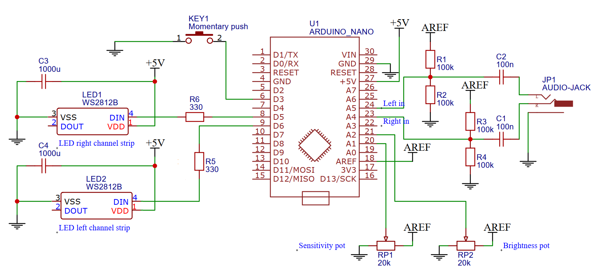

# NanoVULine
Code written to run on the Arduino Nano or Uno to drive LED strips such as WS2812B as a stereo VU meter

## Features
- 10 VU patterns that move in time to the music.
- 7 standby patterns that move without audio input.
- Press the button to change pattern, long press to automatically cycle through patterns.
- Potentiometers for brightness and sensitivity control.
- Remembers the last pattern that you used when you power it off and returns to it on power on.
- Supports 75 LEDs per channel (150 total) on Uno and Nano. Much more on Mega etc.
- Completely open source and hackable. Create your own patterns or use it in whatever you like!

## Demo
Demo of the previous VU meter showing all the available patterns:

Updates to this design with the addition of brightness and sensistivity controls

## Setting up the circuit
If you want to make this on your own, the schematic that I have used is:

If you want to make this on your own, the schematic that I have used is:

## Installation and code usage
1. Download this repository and unzip it somewhere.
2. Open the [Arduino IDE](https://www.arduino.cc/en/Main/Software) then open `Nano_vu_line.ino`.
3. You will need the FastLED and JC_Button libraries installed. In the IDE, go to `Tools` -> `Manage Libraries`. Search for `FastLED` and install the latest version and do the same with `JC_Button`.
4. On the `Nano_vu_line.ino` tab, find the line that says `# define N_PIXELS` and change the number after it to the number of LEDs you have in each string.
6. Plug in the Arduino and upload the code in the usual way, ensuring that the correct board type and com port are selected in the `Tools` menu.

## Extra info
- The more LEDs you have, the more power you will need to provide. Make sure your power source is able to cope.
- Near the top of the code, you can `# define MAX_MILLIAMPS` to be whatever you like. If you are using this from a PC USB port, leave this at 500mA, it will protect you from drawing too much current from the USB port. If you are running this from an AC charger / powerbank and need more brightness or more LEDs, then increase this number.
- If the controller seems to go weird, I've found a quick reflash of the code usually clears it up quickly.
- This project is for entertainment purposes only and the output is not calibrated in any way.
- Code is written to run on the Nano / Uno or equivalent. Using an AVR with more SRAM will result in being able to use more LEDs.

Code is based on demos from the [FastLED](http://fastled.io/) library and code from [Cinelights](https://www.youtube.com/channel/UCOG6Bi2kvpDa1c8gHWZI5CQ) YouTube channel.
